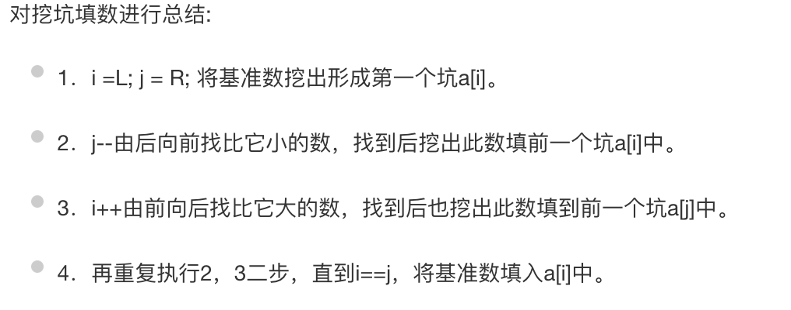
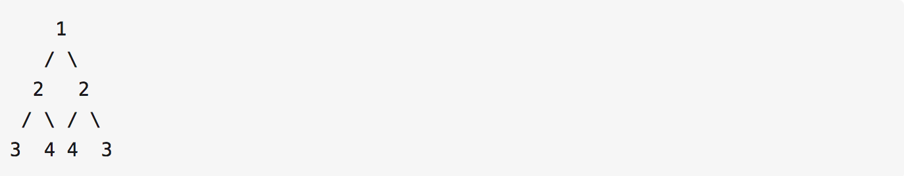
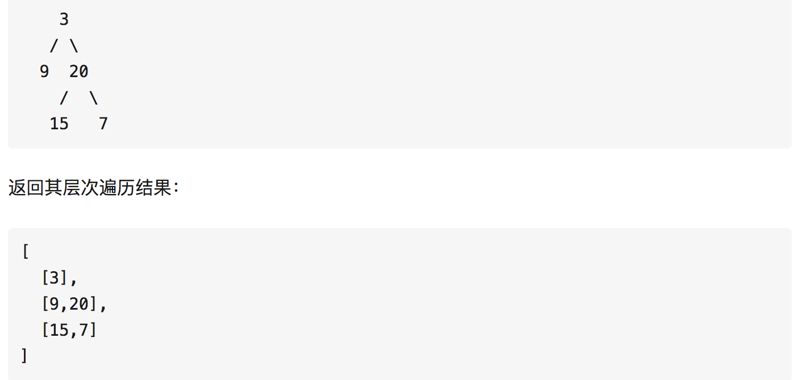
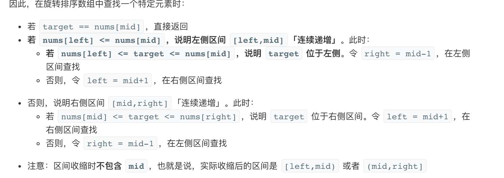

# Leetcode 笔记

### 1. 快速排序




```python
def parition(arr,start,end):
    high=end
    low=start
    mid=arr[low]
    while low<high and arr[high]>=mid:
        high-=1
    arr[low]=arr[high]
    while low<high and arr[low]<mid:
        low+=1
    arr[high]=arr[low]
    arr[low]=mid
    return low

def quickSort(arr,start,end):
    if start>=end: ## 终止条件
        return 
    low=parition(arr,start,end)  # 查词
    quickSort(arr,start,low-1) # 推门
    quickSort(arr,low+1,end) # 推门
```

###  2. 最大的k个数

- 选择排序$O(nk)$

  思路：循环k次，每次找第k个小值，然后返回

  ```
  def selectSort(arr,k):
      if len(arr)<k and k<=0:
          return []
      res=[]
      n=len(arr)
      for i in range(k):
          for j in range(i,n):
              if arr[j]<arr[i]:
                  arr[i],arr[j]=arr[j],arr[i]
      return arr[:k]
          
  ```

  

- 快排O(n)

```python
def parition(arr,start,end):
    high=end
    low=start
    mid=arr[low]
    while low<high:
        while low<high and arr[high]>=mid:
            high-=1
        arr[low]=arr[high]
        while low<high and arr[low]<mid:
            low+=1
        arr[high]=arr[low]
    arr[low]=mid
    return low

def quickSort(arr,start,end,k):
    if start>=end: ## 终止条件
        return 
    if k > len(arr) or k <= 0:
        return [] 
    mid=parition(arr,start,end)  # 查词
    while mid!=k-1:
        if mid>k-1:
            mid=parition(arr,start,mid-1) # 推门
        if mid<k-1:
            mid=parition(arr,mid+1,end) # 推门」

    return arr[:k]
```


- 堆排序


### 3.连续子数组的最大和

给定一个整数数组 nums ，找到一个具有最大和的连续子数组（子数组最少包含一个元素），返回其最大和。

```python
class Solution(object):
    def maxSubArray(self, nums):
        local_max, global_max = nums[0],nums[0]
        for i in nums:
            local_max = max(0, local_max + i)
            global_max = max(global_max, local_max)
        return global_max
```


### 4.数组中只出现一次的数字

一个整型数组里除了两个数字之外，其他的数字都出现了两次。请写程序找出这两个只出现一次的数字。

思路：相同的两个数字进行异或为0,假如只有一个数字出现一次，直接进行异或操作，如何是两个的话，可以进行拆解。

```python
class Solution:
    # 返回[a,b] 其中ab是出现一次的两个数字
    def FindNumsAppearOnce(self, array):
        res = 0
        for i in array:
            res ^= i
        splitBit = 1
        while splitBit & res == 0:
            splitBit = splitBit << 1
        res1 = 0
        res2 = 0
        for i in array:
            if i & splitBit == 0:
                res1 ^= i
            else:
                res2 ^= i
        return [res1,res2]
```

### 5.和为S的连续正数序列

输出所有和为S的连续正数序列。序列内按照从小至大的顺序，序列间按照开始数字从小到大的顺序

思路：维护两个指针，一个指针指向这个连续正数序列的开始，一个指向连续正数序列的结束，判断当前的序列和与目标的关系，不断更新这两个指针的位置。

```python
class Solution:
    def FindContinuousSequence(self, tsum):
        res = []
        i = 1
        j = 2
        curSum = i + j
        while i <= tsum/2:
            if curSum == tsum:
                res.append(range(i,j+1))
                j = j + 1
                curSum += j
            elif curSum > tsum:
                curSum -= i
                i += 1
            else:
                j += 1
                curSum += j
        return res
```

### 6.和为S的两个数字

输入一个递增排序的数组和一个数字S，在数组中查找两个数，使得他们的和正好是S，如果有多对数字的和等于S，输出两个数的乘积最小的。

思路：由于是排好序的数组，因此对于和相等的两个数来说，相互之间的差别越大，那么乘积越小，因此我们使用两个指针，一个从前往后遍历，另一个从后往前遍历数组即可。

```python
class Solution:
    def FindNumbersWithSum(self, array, tsum):
        if len(array)<2:
            return []
        i = 0
        j = len(array)-1
        while i < j:
            if array[i]+array[j] > tsum:
                j -= 1
            elif array[i]+array[j] < tsum:
                i += 1
            else:
                return [array[i],array[j]]
        return []
```

### 7. 链表中环的入口节点

给一个链表，若其中包含环，请找出该链表的环的入口结点，否则，输出null

**思路：**快慢指针，快指针一次走两步，慢指针一次走一步。如果链表中存在环，且环中假设有n个节点，那么当两个指针相遇时，快的指针刚好比慢的指针多走了环中节点的个数，即n步。从另一个角度想，快的指针比慢的指针多走了慢的指针走过的步数，也是n步。相遇后，快指针再从头开始走，快慢指针再次相遇时，所指位置就是入口。

```python
# class ListNode:
#     def __init__(self, x):
#         self.val = x
#         self.next = None
class Solution:
    def EntryNodeOfLoop(self, pHead):
        if pHead==None or pHead.next==None or pHead.next.next==None:
            return None
        low=pHead.next
        fast=pHead.next.next
        while low!=fast:
            if fast.next==None or fast.next.next==None:
                return None
            low=low.next
            fast=fast.next.next
        fast=pHead
        while low!=fast:
            low=low.next
            fast=fast.next
        return fast
```


### 8.二叉树的下一个结点

给定一个二叉树和其中的一个结点，请找出中序遍历顺序的下一个结点并且返回。注意，树中的结点不仅包含左右子结点，同时包含指向父结点的指针

**思路：**如下图所示，二叉树的中序遍历序列是{d,b,h,e,i,a,f,c,g}。


1、如果该节点有右子树，那么它的下一个节点就是它的右子树的最左侧子节点；

2、如果该节点没有右子树且是父节点的左子树，那么下一节点就是父节点；

3、如果该节点没有右子树且是父节点的右子树，比如i节点，那么我们往上找父节点，找到一个节点满足： 它是它的父节点的左子树的节点

```python
# class TreeLinkNode:
#     def __init__(self, x):
#         self.val = x
#         self.left = None
#         self.right = None
#         self.next = None
class Solution:
    def GetNext(self, pNode):
        if not pNode:
            return None
        if pNode.right:
            res = pNode.right
            while res.left:
                res = res.left
            return res
        while pNode.next:
            tmp = pNode.next
            if tmp.left == pNode:
                return tmp
            pNode = tmp
        return None
```

### 9.对称的二叉树

请实现一个函数，用来判断一颗二叉树是不是对称的。注意，如果一个二叉树同此二叉树的镜像是同样的，定义其为对称的。（leetcode101题）

例如，二叉树 `[1,2,2,3,4,4,3]` 是对称的。



**思路**

递归的思想，首先判断头结点是否为空。然后将根节点的左右两个节点假设成两个独立的树，如果左右两个树都为空，返回True。然后看左子树的左结点和右子树的右结点、左子树的右结点和右子树的左结点是否相同，都相同返回True.


```python
class Solution:
    def isSymmetrical(self, pRoot):
        if pRoot is None:
            return True
        return self.isSymmetricTree(pRoot.left,pRoot.right)
    def isSymmetricTree(self,left,right):
        if left is None and right is None:
            return True
        if left is None or right is None or left.val != right.val:
            return False
        return self.isSymmetricTree(left.left,right.right) and self.isSymmetricTree(left.right,right.left)


```

### 10.树的深度


```python
# class TreeNode(object):
#     def __init__(self, x):
#         self.val = x
#         self.left = None
#         self.right = None

class Solution(object):
    def maxdepth(self, root):
        if root is None:
            return 0
        return max(self.maxdepth(root.left), self.maxdepth(root.right))+1
```

### 11. 树的深度优先遍历

- 前序遍历：根节点 -> 左子树 -> 右子树

```python
# class TreeNode(object):
#     def __init__(self, x):
#         self.val = x
#         self.left = None
#         self.right = None

class Solution(object):
    def preorder(self, root):
        if root is None:
            return ''
        print root.val
        if root.lef:
            self.preorder(root.left)
        if root.right:
            self.preorder(root.right)
   
 
# 非递归的树的遍历，主要是进栈的顺序，root->left->right
# 而中序遍历进栈的顺序为，left->root->right
class Solution(object):
    def preorder(self,root):
        if root is None:
            return ''
        stack=[]
        while stack or root:
            while root:
                print(root.val)
                stack.append(root) #(1)
                root=root.left #(2)
        root=stack.pop()
        root=root.right #(3)
```

-  中序遍历：左子树 -> 根节点 -> 右子树

  ```python
  # class TreeNode(object):
  #     def __init__(self, x):
  #         self.val = x
  #         self.left = None
  #         self.right = None
  
  class Solution(object):
      def midorder(self, root):
          if root is None:
              return ''
          if root.lef:
              self.midorder(root.left)
          print root.val
          if root.right:
              self.midorder(root.right)
              
  class Solution(object):
      def inorder(self,root):
          if root is None:
              return ''
          stack=[]
          while stack or root:
              while root:
                  stack.append(root)
                  root=root.left
          root=stack.pop()
          print(root.val)
          root=root.right
  ```

- 后序遍历：左子树 -> 右子树 -> 根节点

  ```python
  # class TreeNode(object):
  #     def __init__(self, x):
  #         self.val = x
  #         self.left = None
  #         self.right = None
  
  class Solution(object):
      def endorder(self, root):
          if root is None:
              return ''
          if root.lef:
              self.endorder(root.left)
          if root.right:
              self.endorder(root.right)
          print root.val
          
          
          
   #后序
  def postorder(root): # 后序
  	stack = []
  	while stack or root:
  		while root:
  			stack.append(root)
  			root = root.lchlid if root.lchild else root.right
  		root = stack.pop()
  		print(root.val)
  		if stack and stack[-1].lchild == root:
  			root = stack[-1].rchild
  		else:
  			root = None
  
     
  ```

- 广度优先遍历，即层次遍历，优先遍历兄弟节点

  ```python
  # class TreeNode(object):
  #     def __init__(self, x):
  #         self.val = x
  #         self.left = None
  #         self.right = None
  
  class Solution(object):
  　　def graorder(self, root):
  　　　　if root is None:
  　　　　　　return ''
  　　　　queue = [root]
  　　　　while queue:
  　　　　　　res = []
  　　　　　　for item in queue:
  　　　　　　　　print item.val,
  　　　　　　　　if item.left:
  　　　　　　　　　　res.append(item.left)
  　　　　　　　　if item.right:
  　　　　　　　　　　res.apppend(item.right)
  　　　　　　queue = res
  ```

- **比较两棵树是否相同**

  ```python
  # class TreeNode(object):
  #     def __init__(self, x):
  #         self.val = x
  #         self.left = None
  #         self.right = None
  
  class Solution(object):
      def issame(self, root1, root2):
          if root1 is None and root2 is None:
              return True
          elif root1 and root2:
              return root1.val==root2.val and issame(root1.left, root2.left) and issame(root1.right, root2.right)
          else:
              return False
  ```

  

### 12.把二叉树打印成多行

从上到下按层打印二叉树，同一层结点从左至右输出。每一层输出一行。（leetcode102题）

给定二叉树: `[3,9,20,null,null,15,7]`,



**思路**

用队列实现，root为空，返回空；队列不为空，记下此时队列中的节点个数temp，temp个节点出队列的同时，记录节点值，并把节点的左右子节点加入队列中。

```python
# class TreeNode:
#     def __init__(self, x):
#         self.val = x
#         self.left = None
#         self.right = None
class Solution:
    def Print(self, pRoot):
        queue = [pRoot]
        res = []
        if not pRoot:
            return []
        while queue:
            templist = []
            templen = len(queue)
            for i in range(templen):
                temp = queue.pop(0)
                templist.append(temp.val)
                if temp.left:
                    queue.append(temp.left)
                if temp.right:
                    queue.append(temp.right)
            res.append(templist)
        return res
```

### 13.按之字形顺序打印二叉树

请实现一个函数按照之字形打印二叉树，即第一行按照从左到右的顺序打印，第二层按照从右至左的顺序打印，第三行按照从左到右的顺序打印，其他行以此类推。

例如：
给定二叉树 `[3,9,20,null,null,15,7]`,

```text
    3
   / \
  9  20
    /  \
   15   7
```

返回锯齿形层次遍历如下：

```text
[
  [3],
  [20,9],
  [15,7]
]
```

在上一题的基础上，加上flag标志判断，若flag为负表示偶数行，从右往左遍历。

**代码**

```python
class Solution:
    def Print(self, pRoot):
        queue = [pRoot]
        res = []
        flag = 1  #判断flag是否为负，如果为负表示偶数行，从右往左遍历
        if not pRoot:
            return []
        while queue:
            templist = []
            templen = len(queue)
            for i in range(templen):
                temp = queue.pop(0)
                templist.append(temp.val)
                if temp.left:
                    queue.append(temp.left)
                if temp.right:
                    queue.append(temp.right)
            if flag == -1:
                templist = templist[::-1]     #反转
            res.append(templist)
            flag *= -1
        return res
```

### 14.满二叉树、完全二叉树

**满二叉树**：一个二叉树，如果每一个层的结点数都达到最大值，则这个二叉树就是满二叉树。也就是说，如果一个二叉树的层数为$K$，且结点总数是$2^k-1$，则它就是满二叉树。

**完全二叉树(Complete Binary Tree)**是效率很高的数据结构，完全二叉树是由[满二叉树](https://baike.baidu.com/item/满二叉树)而引出来的。对于深度为K的，有n个结点的二叉树，当且仅当其每一个结点都与深度为K的满二叉树中编号从1至n的结点一一对应时称之为完全二叉树。

完全二叉树的特点是：

- 只允许最后一层有空缺结点且空缺在右边，即叶子结点只能在层次最大的两层上出现；
- 对任一结点，如果其右子树的深度为$j$，则其左子树的深度必为$j$或$j+1$。 即度为1的点只有1个或0个


#### 14.1 判断一棵树是否是完全二叉树的思路


1. 如果树为空，则直接返回错
2. 如果树不为空：层序遍历二叉树
   - 如果一个结点左右孩子都不为空，则pop该节点，将其左右孩子入队列；
   - 如果遇到一个结点，左孩子为空，右孩子不为空，则该树一定不是完全二叉树；
   - 如果遇到一个结点，左孩子不为空，右孩子为空；或者左右孩子都为空；则该节点之后的队列中的结点都为叶子节点；该树才是完全二叉树，否则就不是完全二叉树；

#### 完全二叉树节点个数(leetcode)


```python
#时间复杂度：O(n)
class Solution:
    def countNodes(self, root: TreeNode) -> int:
        if not root: return 0
        return 1 + self.countNodes(root.left) + self.countNodes(root.right)
      
#时间复杂度：O(log(n)^2)
class Solution:
    def compute_depth(self, node: TreeNode) -> int:
        """
        Return tree depth in O(d) time.
        """
        d = 0
        while node.left:
            node = node.left
            d += 1
        return d

    def exists(self, idx: int, d: int, node: TreeNode) -> bool:
        """
        Last level nodes are enumerated from 0 to 2**d - 1 (left -> right).
        Return True if last level node idx exists. 
        Binary search with O(d) complexity.
        """
        left, right = 0, 2**d - 1
        for _ in range(d):
            pivot = left + (right - left) // 2
            if idx <= pivot:
                node = node.left
                right = pivot
            else:
                node = node.right
                left = pivot + 1
        return node is not None
        
    def countNodes(self, root: TreeNode) -> int:
        # if the tree is empty
        if not root:
            return 0
        
        d = self.compute_depth(root)
        # if the tree contains 1 node
        if d == 0:
            return 1
        
        # Last level nodes are enumerated from 0 to 2**d - 1 (left -> right).
        # Perform binary search to check how many nodes exist.
        left, right = 1, 2**d - 1
        while left <= right:
            pivot = left + (right - left) // 2
            if self.exists(pivot, d, root):
                left = pivot + 1
            else:
                right = pivot - 1
        
        # The tree contains 2**d - 1 nodes on the first (d - 1) levels
        # and left nodes on the last level.
        return (2**d - 1) + left


```

#### [完全二叉树插入器](https://leetcode-cn.com/problems/complete-binary-tree-inserter/)(leetcode 919)

填充规则需要保持完全二叉树的性质不变,**因此只需将叶子节点按填充顺序保存即可.**
**插入节点如果为右孩子节点,则将父节点踢出维护列表**.

```python
# Definition for a binary tree node.
# class TreeNode(object):
#     def __init__(self, x):
#         self.val = x
#         self.left = None
#         self.right = None

class CBTInserter(object):

    def __init__(self, root):
        """
        :type root: TreeNode
        """
        self.root = root
        self.p_no_child = []
        s = [root]
        while s:
            for node in s[:]:
                s.pop(0)
                left, right = node.left, node.right
                if left:
                    s.append(left)
                if right:
                    s.append(right)
                if not left or not right:
                    self.p_no_child.append(node)
                    

    def insert(self, v):
        """
        :type v: int
        :rtype: int
        """
        new_node = TreeNode(v)
        ans = self.p_no_child[0]
        self.p_no_child.append(new_node)
        if not ans.left:
            ans.left = new_node
        else:
            ans.right = new_node
            self.p_no_child.pop(0)
        return ans.val

    def get_root(self):
        """
        :rtype: TreeNode
        """
        return self.root


```

### 15.二叉树的直径

给定一棵二叉树，你需要计算它的直径长度。一棵二叉树的直径长度是任意两个结点路径长度中的最大值。这条路径可能穿过也可能不穿过根结点。

示例 :
给定二叉树

          1
         / \
        2   3
       / \     
      4   5    
返回 3, 它的长度是路径 [4,2,1,3] 或者 [5,2,1,3]。

**注意：**两结点之间的路径长度是以它们之间边的数目表示。

首先我们知道一条路径的长度为该路径经过的节点数减一，所以求直径（即求路径长度的最大值）等效于求路径经过节点数的最大值减一。

而**任意一条路径均可以被看作由某个节点为起点，从其左儿子和右儿子向下遍历的路径拼接得到。**


```python
class Solution(object):
    def diameterOfBinaryTree(self, root):
        self.ans = 1
        def depth(node):
            # 访问到空节点了，返回0
            if not node: return 0
            # 左儿子为根的子树的深度
            L = depth(node.left)
            # 右儿子为根的子树的深度
            R = depth(node.right)
            # 计算d_node即L+R+1 并更新ans
            self.ans = max(self.ans, L+R+1)
            # 返回该节点为根的子树的深度
            return max(L, R) + 1

        depth(root)
        return self.ans - 1


```

### 16.二叉搜索树的最近公共祖先


**算法**

1. 从根节点开始遍历树
2. 如果节点 p 和节点 q 都在右子树上，那么以右孩子为根节点继续 1 的操作
3. 如果节点 p 和节点 q 都在左子树上，那么以左孩子为根节点继续 1 的操作
4. 如果条件 2 和条件 3 都不成立，这就意味着我们已经找到节 p 和节点 q 的 LCA 了

```python
class Solution:
    def lowestCommonAncestor(self, root, p, q):
        """
        :type root: TreeNode
        :type p: TreeNode
        :type q: TreeNode
        :rtype: TreeNode
        """
        # Value of current node or parent node.
        parent_val = root.val

        # Value of p
        p_val = p.val

        # Value of q
        q_val = q.val

        # If both p and q are greater than parent
        if p_val > parent_val and q_val > parent_val:    
            return self.lowestCommonAncestor(root.right, p, q)
        # If both p and q are lesser than parent
        elif p_val < parent_val and q_val < parent_val:    
            return self.lowestCommonAncestor(root.left, p, q)
        # We have found the split point, i.e. the LCA node.
        else:
            return root

          
```

### 17. 二叉树的最近公共祖先

首先在二叉树中搜索给定的节点 pp 和 qq，然后找到它们的最近共同祖先。我们可以使用普通的树遍历来搜索这两个节点。一旦我们达到所需的节点 pp 和 qq，我们就可以回溯并找到最近的共同祖先。

#### 方法一：递归

**算法：**

1. 从根节点开始遍历树。
2. 如果当前节点本身是 p 或 q 中的一个，我们会将变量 mid 标记为 true，并继续搜索左右分支中的另一个节点。
3. 如果左分支或右分支中的任何一个返回 true，则表示在下面找到了两个节点中的一个。
4. 如果在遍历的任何点上，左、右或中三个标志中的任意两个变为 true，这意味着我们找到了节点 p 和 q 的最近公共祖先

```python
# 后序遍历+回溯
class Solution:
    def __init__(self):
        # Variable to store LCA node.
        self.ans = None

    def lowestCommonAncestor(self, root, p, q):
        """
        :type root: TreeNode
        :type p: TreeNode
        :type q: TreeNode
        :rtype: TreeNode
        """
        def recurse_tree(current_node):

            # If reached the end of a branch, return False.
            if not current_node:
                return False

            # Left Recursion
            left = recurse_tree(current_node.left)

            # Right Recursion
            right = recurse_tree(current_node.right)

            # If the current node is one of p or q
            mid = current_node == p or current_node == q

            # If any two of the three flags left, right or mid become True.
            if mid + left + right >= 2:
                self.ans = current_node

            # Return True if either of the three bool values is True.
            return mid or left or right

        # Traverse the tree
        recurse_tree(root)
        return self.ans


```

### 18. 二叉树中第二小的节点

```python
#复杂度分析
#时间复杂度： O(n^2)
#空间复杂度： O(n)
class Solution:
    def findSecondMinimumValue(self, root: TreeNode) -> int:
        ans=[root]
        judge = root.val
        second = 1000000000000
        while ans:
            tmp,n = [],len(ans)
            for i in range(n):
                r=ans.pop(0)
                if r:
                    ans.append(r.left)
                    ans.append(r.right)
                    if r.val != judge:
                        second = min(second,r.val)
            
        return second if second != 1000000000000 else -1


```


**递归**

```python
#时间复杂度： O(n)
#空间复杂度： O(n)
class Solution:
    def findSecondMinimumValue(self, root: TreeNode) -> int:
        judge = root.val
        def find(root):
            if not root:
                return 1000000000000
            if root.val == judge:
                return min(find(root.left),find(root.right))
            return min(root.val,find(root.left),find(root.right))
        second = find(root)
        return second if second !=1000000000000 else -1


```

### 19. 汉诺塔问题


```python
def move(n, a, b, c):
    if(n == 1):
        print(a,"->",c)
        return
    move(n-1, a, c, b)
    move(1, a, b, c)
    move(n-1, b, a, c)
move(3, "a", "b", "c")
```

### 20.LRU 缓存机制

```python
from collections import OrderedDict
class LRUCache(OrderedDict):

    def __init__(self, capacity):
        """
        :type capacity: int
        """
        self.capacity = capacity

    def get(self, key):
        """
        :type key: int
        :rtype: int
        """
        if key not in self:
            return - 1
        
        self.move_to_end(key)
        return self[key]

    def put(self, key, value):
        """
        :type key: int
        :type value: int
        :rtype: void
        """
        if key in self:
            self.move_to_end(key)
        self[key] = value
        if len(self) > self.capacity:
            self.popitem(last = False)

```

- [hashmap+双向链表](https://leetcode-cn.com/problems/lru-cache/solution/shu-ju-jie-gou-fen-xi-python-ha-xi-shuang-xiang-li/)

### 20. 二分查找

```python
def binary_search(arr,item):
    n=len(arr)
    if n>0:
        mid=n//2
        if arr[mid]==item:
            return True
        elif arr[mid]<item:
            return binary_search(arr[mid+1:],item)
        else:
            return binary_search(arr[:mid],item)
    return False
def binary_search(arr,item):
    
    n=len(arr)
    if n<0:
        return False
    
    start=0
    end=n-1
    while start<end:
        mid=(start+end)//2
        if arr[mid]==item:
            return True
        elif arr[mid]<item:
            start=mid+1
        else:
            end=mid
    return False

```

### 21. 循环数组查找

```
输入:nums = [4,5,6,7,0,1,2], target = 0
输出: 4
```

```python
class Solution:
    def search(self, nums: List[int], target: int) -> int:
        if len(nums) == 0:
            return -1
        left, right = 0, len(nums)-1
        while left + 1 < right:
            mid = (left + right) // 2
            if nums[mid] == target:
                return mid
            if nums[left] < nums[mid]:
                if nums[left] <= target and target <= nums[mid]:
                    right = mid
                else:
                    left = mid
            else:
                if nums[mid] <= target and target <= nums[right]:
                    left = mid
                else:
                    right = mid
        if nums[left] == target:
            return left
        if nums[right] == target:
            return right
        return -1

```



## rerference 

- [leetcode ](https://github.com/luliyucoordinate/Leetcode)
- 