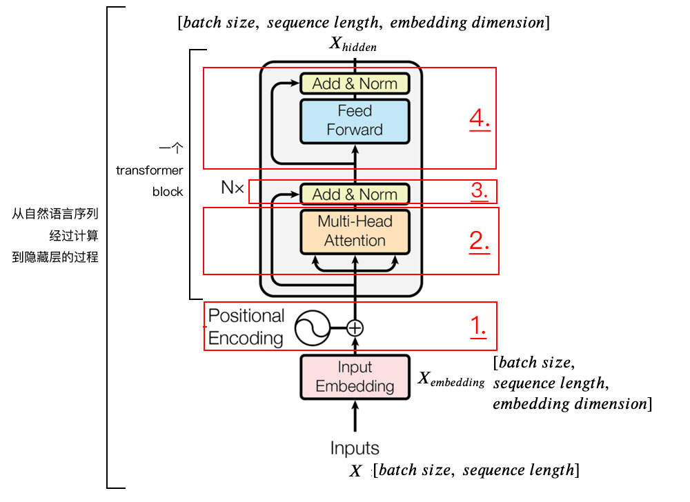
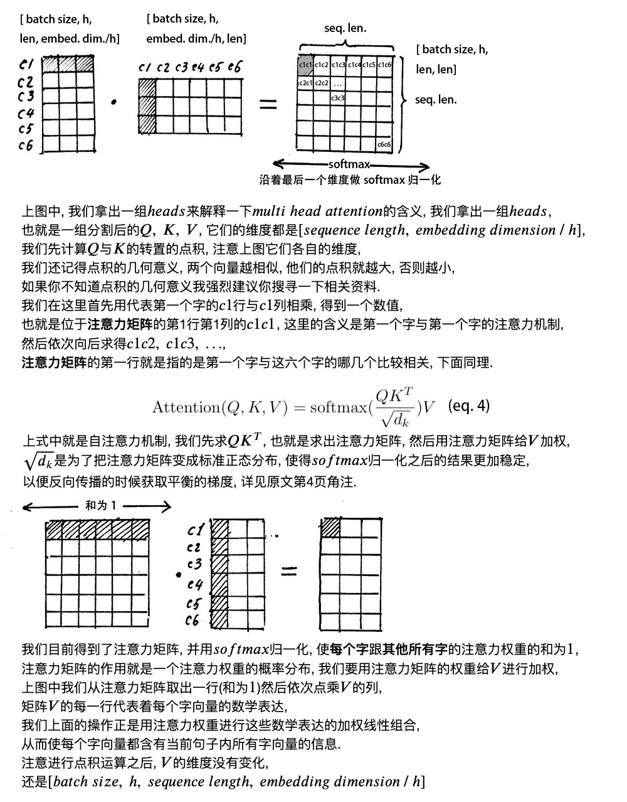

# NLP 相关问题

## 1. 预训练模型

### 1.1 word2vec

核心思想是通过词的上下文得到词的向量化表示，有两种方法：CBOW（通过附近词预测中心词）、Skip-gram（通过中心词预测附近的词）


### 1.2  glove

### 1.3 **ELMo**

## 2.BERT 相关知识点

### 1.简述 bert

Bert 是一个预训练语言模型，它主要有两个任务。第一个任务是将数据集中的句子随机遮掩一部分，通过训练，来预测这些词是什么，加强了句子内部之间的联系；第二个任务是判断两个句子是否是连续的上下句，通过训练来识别，加强了句子外部之间的联系。

bert 的创新点在于它将双向 Transformer 用于语言模型，Transformer 的 encoder 是一次性读取整个文本序列，而不是从左到右或从右到左地按顺序读取，这个特征使得模型能够基于单词的两侧学习，相当于是一个双向的功能。

bert 相较于rnn,lstm可以并发进行，并且可以提取不同层次的信息,反应更全面的句子语义。相较于 word2vec，根据句子上下文获取词义，避免了歧义出现。缺点就是模型参数太多，而且模型太大，少量数据训练时，容易发生过拟合。

### 2. bert的模型结构

bert 是由transformer的编码器构成的.

小Bert是由12个transformer的编码器组成，大bert是由24个transformer的编码器组成，同时相较于transformer的输入而言，bert的输入多了segment id。

### 3.bert的输入

bert的输入是三部分，input_id segment_id 和position_id
input_id 就是将输入转换成词表中的id
segment_id就是区分句子是第几个句子
position_id是记录句子中词的顺序
形式：[cls]上一句话，[sep]下一句话.[sep]

### 4.bert的输出

bert的输出有两种，一种是get_sequence_out(),获取的是整个句子每一个token的向量表示，输出shape是[batch_size, seq_length, hidden_size]；

另一种是get_pooled_out()，获取的是整个句子中的[cls]的表示,输出shape是[batch size,hidden size]。

### 5.transformer



transform模块包含四个步骤:
self_attention_layer、add_and_norm、feed_forward和add_and_norm

在Attention后使用残差结构
残差结构能够很好的**消除层数加深所带来的信息损失问题**

### 6.Multi-head Attention


多头注意力机制定义一个超参数h(head数量)来**提取多重语义**，先将$Query，Key，Value$做线性变化，然后把Query，Key，Value的embedding维度分割成了$h$份，$q$与$k$做相似度计算，然后与v做加权求和得到注意力向量，再把这些注意力向量拼接起来，再通过线性变换得到最终的结果。注意头之间参数不共享，每次$Q，K，V$进行线性变换的参数是不一样的

```python
import tensorflow  as tf
tf.multal(
    tf.nn.softmax(
    tf.multiply(tf.multal(q,k,transpose_b=True),
                1/math.sqrt(float(size_per_head)))),v)
```

### 7.bert的损失函数

bert的损失函数包括两部分，一个是句子中预测遮掩词的损失（MLM），另一个是判断是否是下一句的损失（NSP）
MLM:在 encoder 的输出上添加一个分类层,用嵌入矩阵乘以输出向量，**将其转换为词汇的维度**,用 softmax 计算mask中每个单词的概率
NSP:用一个简单的分类层将 **[CLS]** 标记的输出变换为 2×1 形状的向量,**用 softmax 计算 IsNextSequence 的概率**

### 8.bert适合的任务

bert可以用来做分类、句子语义相似度、阅读理解等任务
对于分类：获得输出的[cls]的向量，做softmax得到每个类别的概率
对于语义相似度：获得输出的[cls]的向量，做softmax得到相似度
对于阅读理解：输入[cls]问题[sep]文本[sep]，输出的是整句话的向量，将其分成两部分，转换成对应的答案开始和结束位置的概率。

### 10.bert的优点和缺点及可以改进的地方

**优点**

bert将双向 Transformer 用于语言模型，Transformer 的 encoder 是一次性读取整个文本序列，而不是从左到右或从右到左地按顺序读取，这个特征使得模型能够基于单词的两侧学习，相当于是一个双向的功能。

bert 相较于rnn,lstm可以并发进行，**并且可以提取不同层次的信息,反应更全面的句子语义**。相较于 word2vec，根据句子上下文获取词义，避免了歧义出现。
**缺点**

bert模型参数太多，而且模型太大，少量数据训练时，容易发生过拟合。
bert模型预训练会出现mask,而在下游的微调任务中并不会出现，使得不匹配。
bert模型会将词分成词根一样的词片，若随机遮掩一些词的时候，若遮掩住中间的的词片，则会发生不是根据上下文的语义预测的。

### 11.源码中Attention后实际的流程是如何的？

Transform模块中：在**残差连接**之前，对output_layer进行了dense+dropout后再合并input_layer进行的layer_norm得到的attention_output
所有attention_output得到并合并后，也是先进行了全连接，而后再进行了dense+dropout再合并的attention_output之后才进行layer_norm得到最终的layer_output

### 12.预训练目标

BERT预训练过程包含两个不同的预训练任务，分别是Masked Language Model和Next Sentence Prediction任务。

**Masked Language Model（MLM）**

通过随机掩盖一些词（替换为统一标记符[MASK]），然后预测这些被遮盖的词来训练双向语言模型，并且使每个词的表征参考上下文信息。

这样做会产生两个缺点：（1）会造成预训练和微调时的不一致，因为在微调时[MASK]总是不可见的；（2）由于每个Batch中只有15%的词会被预测，因此模型的收敛速度比起单向的语言模型会慢，训练花费的时间会更长。对于第一个缺点的解决办法是，把80%需要被替换成[MASK]的词进行替换，10%的随机替换为其他词，10%保留原词。由于Transformer Encoder并不知道哪个词需要被预测，哪个词是被随机替换的，这样就强迫每个词的表达需要参照上下文信息。对于第二个缺点目前没有有效的解决办法，但是从提升收益的角度来看，付出的代价是值得的。

**Next Sentence Prediction（NSP）**

为了训练一个理解句子间关系的模型，引入一个下一句预测任务。这一任务的训练语料可以从语料库中抽取句子对包括两个句子A和B来进行生成，其中50%的概率B是A的下一个句子，50%的概率B是语料中的一个随机句子。NSP任务预测B是否是A的下一句。NSP的目的是获取句子间的信息，这点是语言模型无法直接捕捉的。

Google的论文结果表明，这个简单的任务对问答和自然语言推理任务十分有益，但是后续一些新的研究[15]发现，去掉NSP任务之后模型效果没有下降甚至还有提升。我们在预训练过程中也发现NSP任务的准确率经过1-2个Epoch训练后就能达到98%-99%，去掉NSP任务之后对模型效果并不会有太大的影响。

### 13.最终输入结果会变成下面3个embedding拼接的表示


### 14.**transformer**和**LSTM**的最大区别

**transformer**和**LSTM**的最大区别, 就是LSTM的训练是迭代的, 是一个接一个字的来, 当前这个字过完LSTM单元, 才可以进下一个字, 而transformer的训练是并行了, 就是所有字是全部同时训练的, 这样就大大加快了计算效率, transformer使用了位置嵌入(𝑝𝑜𝑠𝑖𝑡𝑖𝑜𝑛𝑎𝑙 𝑒𝑛𝑐𝑜𝑑𝑖𝑛𝑔)来理解语言的顺序, 使用自注意力机制和全连接层来进行计算

### 15.$positional \ encoding$, 即**位置嵌入**(或位置编码);

由于transformer模型**没有**循环神经网络的迭代操作, 所以我们必须提供每个字的位置信息给transformer, 才能识别出语言中的顺序关系.   
现在定义一个位置嵌入的概念, 也就是$positional \ encoding$, 位置嵌入的维度为$[max \ sequence \ length, \ embedding \ dimension]$, 嵌入的维度同词向量的维度, $max \ sequence \ length$属于超参数, 指的是限定的最大单个句长.   
注意, 我们一般以字为单位训练transformer模型, 也就是说我们不用分词了, 首先我们要初始化字向量为$[vocab \ size, \ embedding \ dimension]$, $vocab \ size$为总共的字库数量, $embedding \ dimension$为字向量的维度, 也是每个字的数学表达.    
在这里论文中使用了$sine$和$cosine$函数的线性变换来提供给模型位置信息:   
$$PE_{(pos,2i)} = sin(pos / 10000^{2i/d_{\text{model}}}) \quad PE_{(pos,2i+1)} = cos(pos / 10000^{2i/d_{\text{model}}})\tag{eq.1}$$
上式中$pos$指的是句中字的位置, 取值范围是$[0, \ max \ sequence \ length)$, $i$指的是词向量的维度, 取值范围是$[0, \ embedding \ dimension)$, 上面有$sin$和$cos$一组公式, 也就是对应着$embedding \ dimension$维度的一组奇数和偶数的序号的维度, 例如$0, 1$一组, $2, 3$一组, 分别用上面的$sin$和$cos$函数做处理, 从而产生不同的周期性变化, 而位置嵌入在$embedding \ dimension$维度上随着维度序号增大, 周期变化会越来越慢, 而产生一种包含位置信息的纹理, 就像论文原文中第六页讲的, 位置嵌入函数的周期从$2 \pi$到$10000 * 2 \pi$变化, 而每一个位置在$embedding \ dimension$维度上都会得到不同周期的$sin$和$cos$函数的取值组合, 从而产生独一的纹理位置信息, 模型从而学到位置之间的依赖关系和自然语言的时序特性.   
下面画一下位置嵌入, 可见纵向观察, 随着$embedding \ dimension$增大, 位置嵌入函数呈现不同的周期变化.


### 16. $self \ attention \ mechanism$, **自注意力机制**;



### 17.Attention Mask


注意, 在上面$self \ attention$的计算过程中, 我们通常使用$mini \ batch$来计算, 也就是一次计算多句话, 也就是$X$的维度是$[batch \ size, \ sequence \ length]$, $sequence \ length$是句长, 而一个$mini \ batch$是由多个不等长的句子组成的, 我们就需要按照这个$mini \ batch$中最大的句长对剩余的句子进行补齐长度, 我们一般用$0$来进行填充, 这个过程叫做$padding$.   
但这时在进行$softmax$的时候就会产生问题, 回顾$softmax$函数$\sigma (\mathbf {z} )_{i}={\frac {e^{z_{i}}}{\sum _{j=1}^{K}e^{z_{j}}}}$, $e^0$是1, 是有值的, 这样的话$softmax$中被$padding$的部分就参与了运算, 就等于是让无效的部分参与了运算, 会产生很大隐患, 这时就需要做一个$mask$让这些无效区域不参与运算, 我们一般给无效区域加一个很大的负数的偏置, 也就是:
$$z_{illegal} = z_{illegal} + bias_{illegal}$$
$$bias_{illegal} \to -\infty$$
$$e^{z_{illegal}} \to 0 $$
经过上式的$masking$我们使无效区域经过$softmax$计算之后还几乎为$0$, 这样就避免了无效区域参与计算.

### 18.𝐿𝑎𝑦𝑒𝑟 𝑁𝑜𝑟𝑚𝑎𝑙𝑖𝑧𝑎𝑡𝑖𝑜𝑛 Layer Normalization和残差连接


### 19.  $transformer \ encoder$整体结构.   


### 20. dropout与L1 L2正则的关系与区别：

都是避免过拟合，前者通过控制信噪比压缩互信息增加泛化能力，后者限制参数在Loss等高线上的可取值范围

