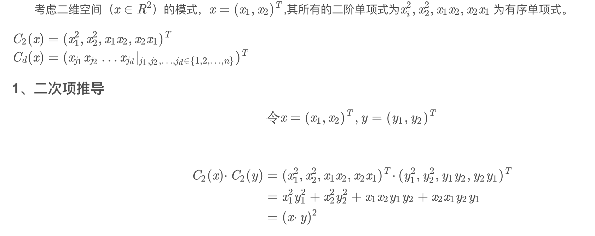

# 机器学习面试1000题

### 1. LR与SVM的联系和区别

**LR与SVM的相同点：**

**1、都是有监督的分类算法；**

**2、如果不考虑核函数，LR和SVM都是线性分类算法。**

它们的分类决策面都是线性的。

**3、LR和SVM都是判别式模型。**

LR、SVM、决策树等判别式模型直接生成一个表示P(Y|X)或者Y=f(X)的判别函数。而生成式模型，例如朴素贝叶斯（NB），隐马尔可夫链（HMM），都是先计算联合概率分布P(Y,X)，然后通过贝叶斯公式转化为P(Y|X)。

**LR与SVM的不同点：**

**1、本质上是loss函数不同，或者说分类的原理不同。**

LR的目标是最小化模型分布和经验分布之间的交叉熵：

LR基于概率理论中的极大似然估计。首先假设样本为0或者1的概率可以用sigmoid函数来表示，然后通过极大似然估计的方法估计出参数的值，即让模型产生的分布P(Y|X)尽可能接近训练数据的分布。

SVM的目标是最大化分类间隔（硬SVM），或者最大化 [分类间隔—a*分错的样本数量]（软SVM）

SVM基于几何间隔最大化原理，认为几何间隔最大的分类面为最优分类面 

**2、SVM是结构风险最小化，LR则是经验风险最小化。**

结构风险最小化就是在训练误差和模型复杂度之间寻求平衡，防止过拟合，减小泛化误差。为了达到结构风险最小化的目的，最常用的方法就是添加正则项。

SVM的loss函数的第一项可看作L2正则项；LR需要加入正则化项。

**3. SVM只考虑分界面附近的少数点，而LR则考虑所有点。**

影响SVM决策面的样本点只有少数的支持向量。在支持向量外添加或减少任何样本点，对分类决策面没有任何影响。

在LR中，每个样本点都会影响决策面。决策面会倾向于**远离样本数量较多的类别**。如果不同类别之间的数量严重不平衡，一般需要先对数据做balancing。

**4、SVM不能产生概率，LR可以产生概率。**

**5、在解决非线性问题时，SVM可采用核函数的机制，而LR通常不采用核函数的方法。**

SVM只有少数几个样本需要参与核计算（即kernal machine解的系数是稀疏的）。

LR里每个样本点都要参与核计算，计算复杂度太高，故LR通常不用核函数。

**6、SVM计算复杂，但效果比LR好，适合小数据集；LR计算简单，适合大数据集，可以在线训练。**

### 2. 核函数

Kernels give a way to compute dot products in some feature space without even knowing what this space is and what is 𝜑

**核方法** 是一类把低维空间的非线性可分问题，转化为高维空间的线性可分问题的方法。

核是一种两个向量在某个高纬空间里的dot的一种方式，节省了向高纬空间的转换。

- [Kernel Methods in Machine Learning: Gaussian Kernel](https://www.guru99.com/kernel-methods-machine-learning.html)
- [How to intuitively explain what a kernel is?](https://stats.stackexchange.com/questions/152897/how-to-intuitively-explain-what-a-kernel-is)

