# 机器学习面试1000题

### 1. LR与SVM的联系和区别

**LR与SVM的相同点：**

**1、都是有监督的分类算法；**

**2、如果不考虑核函数，LR和SVM都是线性分类算法。**

它们的分类决策面都是线性的。

**3、LR和SVM都是判别式模型。**

LR、SVM、决策树等判别式模型直接生成一个表示P(Y|X)或者Y=f(X)的判别函数。而生成式模型，例如朴素贝叶斯（NB），隐马尔可夫链（HMM），都是先计算联合概率分布P(Y,X)，然后通过贝叶斯公式转化为P(Y|X)。

**LR与SVM的不同点：**

**1、本质上是loss函数不同，或者说分类的原理不同。**

LR的目标是最小化模型分布和经验分布之间的交叉熵：


LR基于概率理论中的极大似然估计。首先假设样本为0或者1的概率可以用sigmoid函数来表示，然后通过极大似然估计的方法估计出参数的值，即让模型产生的分布P(Y|X)尽可能接近训练数据的分布。

SVM的目标是最大化分类间隔（硬SVM），或者最大化 [分类间隔—a*分错的样本数量]（软SVM）


SVM基于几何间隔最大化原理，认为几何间隔最大的分类面为最优分类面 

**2、SVM是结构风险最小化，LR则是经验风险最小化。**

结构风险最小化就是在训练误差和模型复杂度之间寻求平衡，防止过拟合，减小泛化误差。为了达到结构风险最小化的目的，最常用的方法就是添加正则项。

SVM的loss函数的第一项可看作L2正则项；LR需要加入正则化项。

**3. SVM只考虑分界面附近的少数点，而LR则考虑所有点。**

影响SVM决策面的样本点只有少数的支持向量。在支持向量外添加或减少任何样本点，对分类决策面没有任何影响。

在LR中，每个样本点都会影响决策面。决策面会倾向于**远离样本数量较多的类别**。如果不同类别之间的数量严重不平衡，一般需要先对数据做balancing。

**4、SVM不能产生概率，LR可以产生概率。**

**5、在解决非线性问题时，SVM可采用核函数的机制，而LR通常不采用核函数的方法。**

SVM只有少数几个样本需要参与核计算（即kernal machine解的系数是稀疏的）。

LR里每个样本点都要参与核计算，计算复杂度太高，故LR通常不用核函数。

**6、SVM计算复杂，但效果比LR好，适合小数据集；LR计算简单，适合大数据集，可以在线训练。**

### 2. 核函数

**核技巧**是一种利用核函数直接计算 ![[公式]](https://www.zhihu.com/equation?tex=%5Clangle+%5Cphi%28x%29%2C%5Cphi%28z%29+%5Crangle%E2%80%8B) ，以避开分别计算 ![[公式]](https://www.zhihu.com/equation?tex=%5Cphi%28x%29%E2%80%8B) 和 ![[公式]](https://www.zhihu.com/equation?tex=%5Cphi%28z%29%E2%80%8B) ，从而加速核方法计算的技巧。

得益于SVM对偶问题的表现形式，核技巧可以应用于SVM。 ![[公式]](https://www.zhihu.com/equation?tex=%281%29) 可改写为

![[公式]](https://www.zhihu.com/equation?tex=%5Cbegin%7Bequation%7D%5Cbegin%7Baligned%7D%26+%5Cmax_%7B%5Calpha%7D%26+%26%5Csum_%7Bi%3D1%7D%5Em+%5Calpha_i-%5Cfrac%7B1%7D%7B2%7D%5Csum_%7Bi%3D1%7D%5Em%5Csum_%7Bj%3D1%7D%5Em+%5Calpha_i+%5Calpha_j+y_i+y_j+K%28x_i%2Cx_j%29%5C%5C%26+%5Ctext%7Bsubject+to%7D%26+%26+++%5Csum_%7Bi%3D1%7D%5Em+%5Calpha_i+y_i+%3D+0++%5C%5C+%26+%26+%26+0+%5Cleqslant+%5Calpha_i+%5Cleqslant+C%2C%5C%3B+i+%3D+1%2C%5Cdots%2Cm%5Cend%7Baligned%7D%5Cend%7Bequation%7D%5Ctag%7B5%7D+)

![[公式]](https://www.zhihu.com/equation?tex=+f%28x%29++%3D++%5Csum_%7Bi+%3D+1%7D%5Em+%5Calpha_iy_iK%28x_i%2Cx%29+%2Bb+%5Ctag%7B6%7D+)


Kernels give a way to compute dot products in some feature space without even knowing what this space is and what is 𝜑

**核方法** 是一类把低维空间的非线性可分问题，转化为高维空间的线性可分问题的方法。

核是一种两个向量在某个高纬空间里的dot的一种方式，节省了向高纬空间的转换。


**多项式核的例子**


将x,y 映射到三维度空间中


```python


def mapping(x, y):    
	x = np.c_[(x, y)]				
    if len(x) >	2:        
    	x_1 = x[:,0]**2        
        x_2 = np.sqrt(2)*x[:,0]*x[:,1]        
        x_3 = x[:,1]**2								
    else:            
    	x_1 = x[0]**2        
        x_2 = np.sqrt(2)*x[0]*x[1]        
        x_3 = x[1]**2			    
   trans_x = np.array([x_1, x_2, x_3])				
   return trans_x
  
  
x = np.array([1,1,2,3,3,6,6,6,9,9,10,11,12,13,16,18])
y = np.array([18,13,9,6,15,11,6,3,5,2,10,5,6,1,3,1])
label = np.array([1,1,1,1,0,0,0,1,0,1,0,0,0,1,0,1])
fig = plt.figure()
plt.scatter(x, y, c=label, s=60)
plt.show()

# 空间映射
x_1  = mapping(x, y)
x_1.shape

fig = plt.figure()
ax = fig.add_subplot(111, projection='3d')
ax.scatter(x_1[0], x_1[1], x_1[2], c=label, s=60)
ax.view_init(30, 185)ax.set_xlabel('X Label')
ax.set_ylabel('Y Label')
ax.set_zlabel('Z Label')
plt.show()	
```


- [Kernel Methods in Machine Learning: Gaussian Kernel](https://www.guru99.com/kernel-methods-machine-learning.html)
- [How to intuitively explain what a kernel is?](https://stats.stackexchange.com/questions/152897/how-to-intuitively-explain-what-a-kernel-is)
- [kernel pdf](https://www.cs.upc.edu/~belanche/Talks/MEETUP-July2014.pdf)

### 3. 请简要介绍下SVM

SVM，全称是support vector machine，中文名叫支持向量机。SVM是一个面向数据的分类算法，它的目标是为确定一个分类超平面，从而将不同的数据分隔开。

支持向量机学习方法包括构建由简至繁的模型：线性可分支持向量机、线性支持向量机及非线性支持向量机。当训练数据线性可分时，通过硬间隔最大化，学习一个线性的分类器，即线性可分支持向量机，又称为硬间隔支持向量机；当训练数据近似线性可分时，通过软间隔最大化，也学习一个线性的分类器，即线性支持向量机，又称为软间隔支持向量机；当训练数据线性不可分时，通过使用核技巧及软间隔最大化，学习非线性支持向量机。

### 4.**LR与线性回归的区别与联系**


线性回归和LR都是广义上的线性回归，都是通过一系列输入特征拟合一条曲线来完成未知输入的预测。


### 5. **谈谈判别式模型和生成式模型？**

判别方法：由数据直接学习决策函数 $y=f(x)$，或者由条件分布概率 $P(Y|X)$作为预测模型，即判别模型。

生成方法：由数据学习联合概率密度分布函数 $P(X,Y)$,然后求出条件概率分布$P(Y|X)$作为预测的模型，即生成模型。

由生成模型可以得到判别模型，但由判别模型得不到生成模型。

常见的判别模型有：K近邻、SVM、决策树、感知机、线性判别分析（LDA）、线性回归、传统的神经网络、逻辑斯蒂回归、boosting、条件随机场

常见的生成模型有：朴素贝叶斯、隐马尔可夫模型、高斯混合模型、文档主题生成模型（LDA）、限制玻尔兹曼机

### 6. **协方差和相关性有什么区别？**

相关性是协方差的标准化格式。协方差本身很难做比较。例如：如果我们计算工资（$）和年龄（岁）的协方差，因为这两个变量有不同的度量，所以我们会得到不能做比较的不同的协方差。为了解决这个问题，我们计算相关性来得到一个介于-1和1之间的值，就可以忽略它们各自不同的度量

### 7.  softmax 推导


神经元的输出设为：

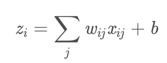

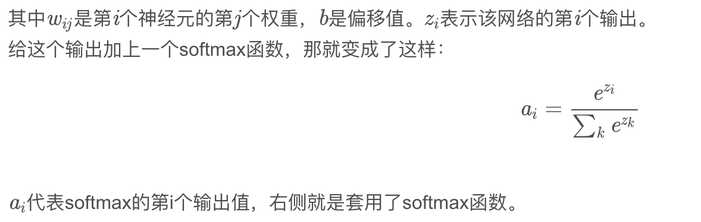


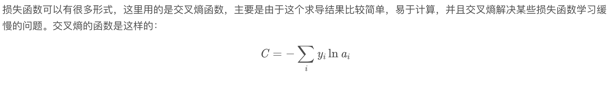

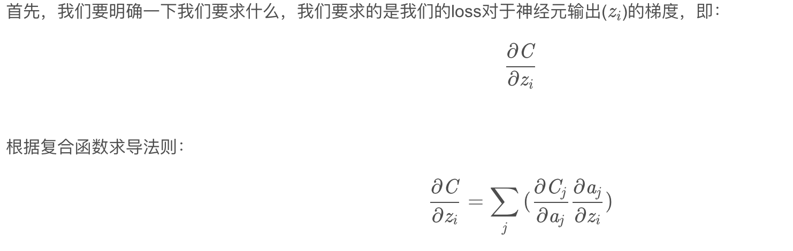

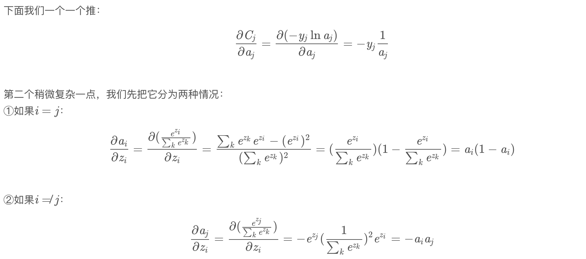


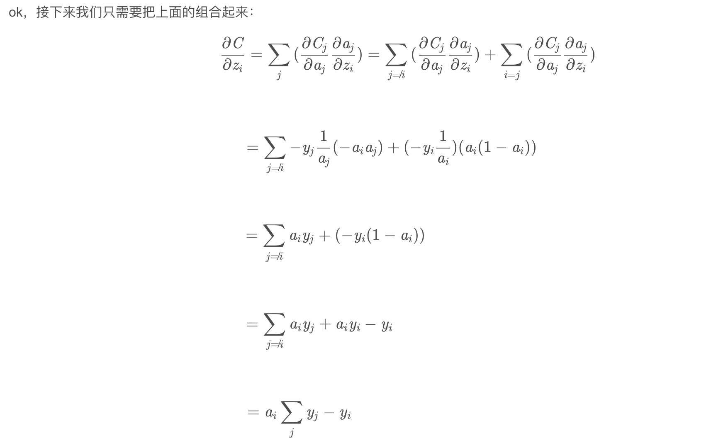

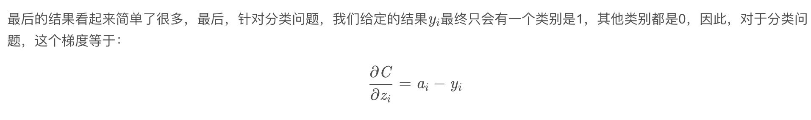

### 8. 深度学习领域中见过哪些不可导的操作，不可导怎么办？比如|x|的求导。

- 次梯度

深度学习算法通常需要反向传播来进行优化，这就涉及到求导的问题. 激活函数需要满足单调，处处可导，有界等条件。如传统的sigmoid函数，但是现在很多激活函数并不是处处可导的。如ReLU在x=0 处不可导，那么如何实现反向传播和模型优化呢? 答案就是:次梯度

![[公式]](https://www.zhihu.com/equation?tex=c%3C%3D%5Cfrac%7Bf%28x%29-f%5Cleft%28x_%7B0%7D%5Cright%29%7D%7Bx-x_%7B0%7D%7D+%5C%5C)

对于ReLU函数， 当x>0的时候，其导数为1。当x<0时，其导数为0。则ReLU函数在x=0的次梯度是![[公式]](https://www.zhihu.com/equation?tex=c%5Cin%5B0%EF%BC%8C1%5D)这里是次梯度有多个，可以取0，1之间的任意值. 工程上为了方便取c=0即可。

- VAE中对高斯分布的重参数

VAE中隐变量z一般取高斯分布，然后从这个分布中采样。但是这个采样操作是不可导的，进而导致整个模型无法BP。 解决方法就是Reparametrization tricks重参数技巧。

我们首先从从均值为0，标准差为1的高斯分布中采样，再放缩平移得到Z。

![[公式]](机器学习面试1000题.assets/equation.svg)

这样从![[公式]](机器学习面试1000题.assets/equation-1587520943799.svg)到 ![[公式]](机器学习面试1000题.assets/equation-1587520943814.svg)只涉及了线性操作(平移缩放)，采样操作在NN计算图之外，而![[公式]](https://www.zhihu.com/equation?tex=%5Cepsilon+)对于NN来说只是一个常数

### 9. FM 对比 SVM

SVM是大家熟知的支持向量机模型，其模型原理在这里就不详述了。

SVM的线性模型函数表示为：

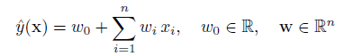

其非线性形式可以通过核映射kernel mapping的方式得到，如下所示：

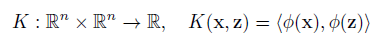

其中多项式核表示为：

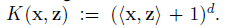

当d=2时为二次多项式，表示为：

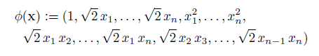

多项式核映射后的模型函数表示为：

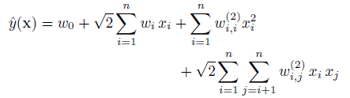

**SVM和FM的主要区别在于，SVM的二元特征交叉参数是独立的**，如$w_{ij}$，而FM的二元特征交叉参数是两个k维的向量$v_{i}$、$v_{j}$，这样子的话，$<v_{i},v_{j}>$和$<v_{i},v_{k}>$就不是独立的，而是相互影响的。

  为什么线性SVM在和多项式SVM在稀疏条件下效果会比较差呢？线性svm只有一维特征，不能挖掘深层次的组合特征在实际预测中并没有很好的表现；而多项式svn正如前面提到的，**交叉的多个特征需要在训练集上共现才能被学习到，否则该对应的参数就为0，这样对于测试集上的case而言这样的特征就失去了意义，因此在稀疏条件下，SVM表现并不能让人满意。**而FM不一样，通过向量化的交叉，可以学习到不同特征之间的交互，进行提取到更深层次的抽象意义。

  此外，FM和SVM的区别还体现在：1）FM可以在原始形式下进行优化学习，而基于kernel的非线性SVM通常需要在对偶形式下进行；2）FM的模型预测是与训练样本独立，而SVM则与部分训练样本有关，即支持向量。

### 10.  如何解决神经网络训练时loss不下降的问题

loss不下降一般分为三种，即：训练集上loss不下降，验证集上loss不下降，和测试集上loss不下降。

#### 训练集上loss不下降


# reference

- [**numpy 实现所有的基础模型**](https://www.python-course.eu/k_nearest_neighbor_classifier.php)
- [from scratch](https://gluon.mxnet.io/chapter04_convolutional-neural-networks/cnn-batch-norm-scratch.html):happy:
- [斯坦福大学2014机器学习教程中文笔记目录](http://www.ai-start.com/ml2014/):happy:
- [机器学习初学者](http://www.ai-start.com/):happy:
- [机器学习爱好者](https://zhuanlan.zhihu.com/fengdu78)
- [决策树（中）——Random Forest、Adaboost、GBDT （非常详细）](https://zhuanlan.zhihu.com/p/86263786)


