# 项目笔记

## 1.移动社交网络

- 平均度

  在无向网络中，网络的平均度为所有节点度的算数平均

- 聚集系数

  是用来描述网络 中节点的邻居的联系紧密程度，即分析朋友的朋友也是朋友的概率。一个节点 的聚集系数Ci的取值区间为[0,1]，当Ci = 1时，表示节点 i 的所有邻居之间均存 在连接。当Ci = 0时，表示节点 i 的邻居节点之间没有任何连接。网络聚集系数 定义为网络中所有节点聚集系数的平均值。

  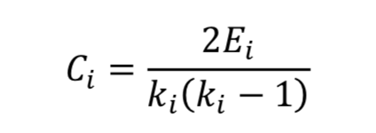

- 节点度(degree)

  是指与节点关联的边的数量

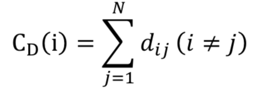

- 同配系数

  同配系数用作考察度连接节点之间的相配性，是一种基于度的皮尔森相关 系数。在网络中，若大度节点倾向于和大度节点相连，则表示网络是同配的;反 之若大度节点倾向与小度节点相连，则表示网络是异配的

  

- 介数中心度

  介数定义网络中所有最短路径中经过该节点的路径数目占最短路径总数的 比例。

- 连通子图结构分析

- 呼出比

  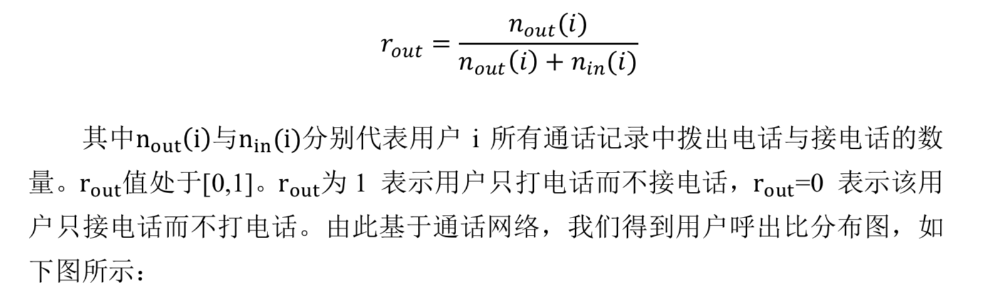

结论：

- 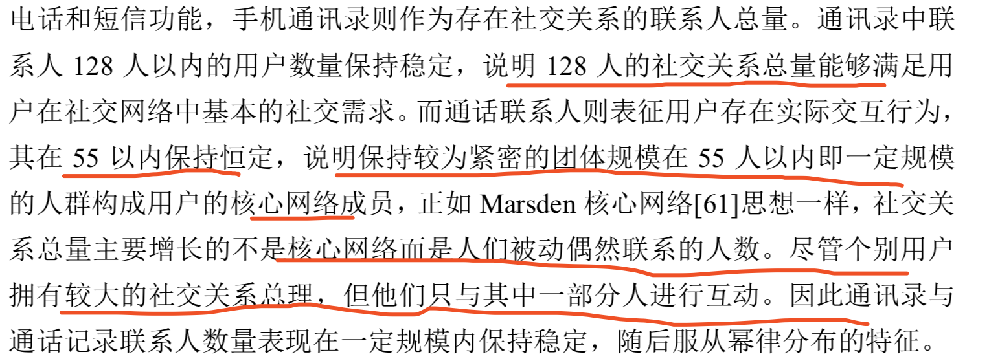，

  无效关系比率

- 日均通话时长、频率及通话平均时长、短信数量与用户年龄成正相关关系，说明随着年龄的增长，用户之间的交互频 率和质量不断提高。而呼出比则与年龄成负相关关系，随着年龄的增加，打电 话的时间占通话总时长的比例降低。从性别上来看，用户在通话平均时间和短 信数量呈现出较大异质性，即女性相比于男性通话时间较长，而短信数量相比 于男性较少。

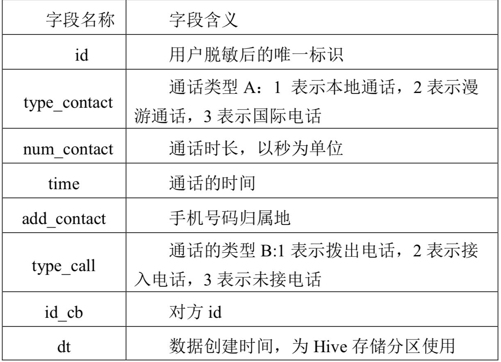

亲属关系判别：

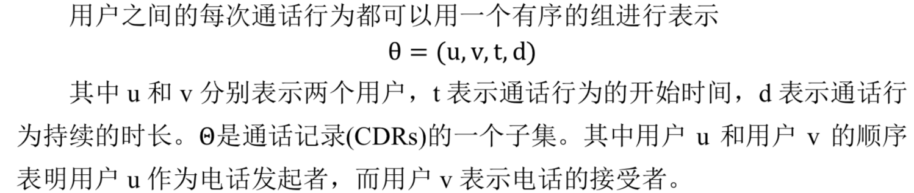

总时长：通话数据采集的时间跨度是 1 年，一年之中用户与用户之间的 通话信息的总时长，能够刻画用户之间的紧密程度

平均通话时间：即用户与用户之间通话时长的均值

平均通话间隔：比如三天五天。

周末与工作日指标

不同时间段的指标

互动频率：

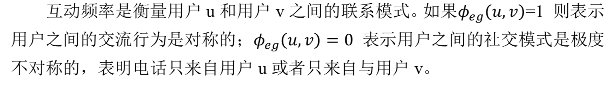

对用户之间交流模式的一种整体刻画，用户之间间隔 10 天通话 3 分钟与间隔 3 天通话 3 分钟的交流模式有明显不同

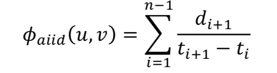

地域性，方向性，时段性，年龄，一些符合生成的指标 有效关系必须，无效关系比例

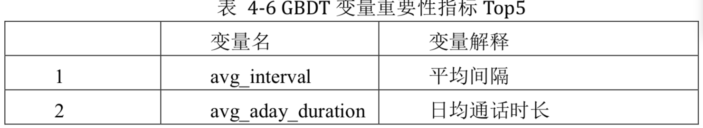

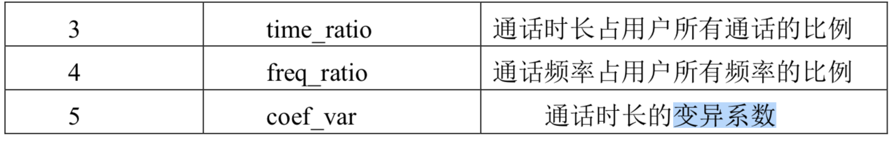

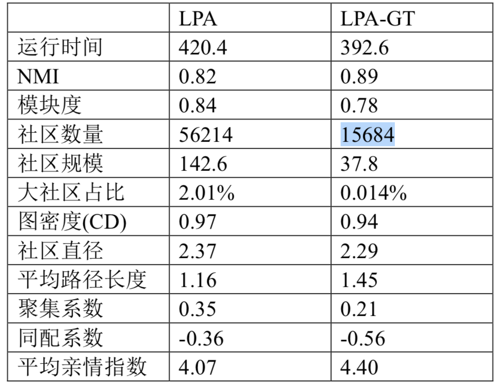

结果分析：

**LPA-GT 社区划分结果具有数量 多，规模小的特点，而 LPA 则相反数量相对较少而规模相对较大**。社区划分结 果的差异性主要原因可能是**等权网络**中信息传播效率较高，而**加权网络中边权之间的差异越大越不利于信息的传**播[64]，以信息传播的角度上考虑，假如信息 在网络中随机的进行传播不考虑边权的情况下，则信息传播的区域则相对较大， 覆盖范围则较大，这也是 LPA 的社区规模较大的主要原因。而信息传播只在边 权较大的节点之间进行传播，则传播效率和范围都会有所限制。**正如一条微博 随机转发则传播范围较广，若只是在关系比较密切的人群如亲属关系、密友关 系这种强连接中进行传播，则传播范围则相对较小****。LPA—GT 是以亲属关系指 数为权重的加权网络，相比对 LPA 的等权网络其信息传播的效率较低，从而其 社区划分出较多的群组，且群组规模较小**

